# Milestone 4: Microservices using Google Pub/Sub Communication
## Objective:
* Get familiar with microservices.
* Implement microservice using Python.
* Containerize Python application.
* Configure Pub/Sub Subscription(s) to filter the receiving messages.

## Repository:
[https://github.com/GeorgeDaoud3/SOFE4630U-MS4](https://github.com/GeorgeDaoud3/SOFE4630U-MS4)

## Introduction 

1. See the following video for [the foundations of microservices](https://www.youtube.com/watch?v=lL_j7ilk7rc).
2. Read this document about [Event-driven architecture with Pub/Sub](https://cloud.google.com/solutions/event-driven-architecture-pubsub). Focus on the **event filter** technique, its advantages, limitations, and implementation. The microservices implemented in the milestone will use this technique for communication.
3. A cloud-based solution for a cloud-based election system will be implemented in this milestone. The following figure shows the architecture of the system.

   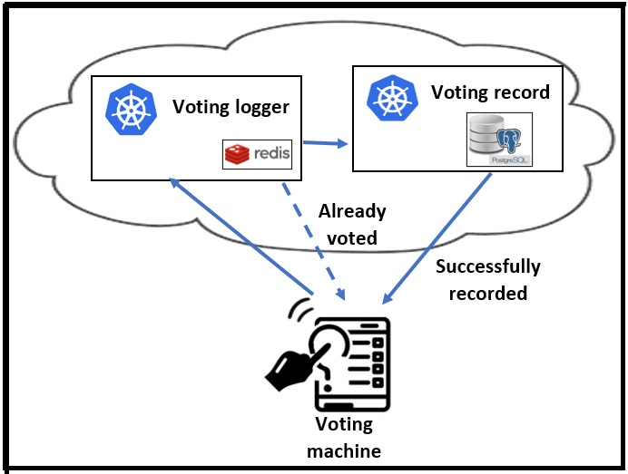
   
   It consists of:
   1. **A voting machine**
      * A Python script that simulates a voting machine. It's supposed to run on your local machine.
      * First, it asks for the **election ID** and the **machine ID**.
      * Then, it generates random votes and sends them to a **voting logger** service.
      * Finally, it will wait for a response for 10 seconds.
      * There are three expected responses: 
         1. **Already voted** if a vote with the same **voter ID** was processed before.
         2. A **successful** message if the vote is recorded successfully.
         3. **Time out** if the vote processing takes much longer than expected (10 sec).
      * You can run multiple script instances but with different **machine ID**s. 
   2. A **voting logger** service.
      * The service accesses a Redis server to store the IDs of the voters who have already been voted on.
      * When a vote is received,
         * Redis will be checked for the **voter ID**.
         * If the **voter ID** exists, an **Already voted** message will be sent to the voting machine.
         * Otherwise,
            * The **voter ID** will be stored in the Redis database to prevent the voter from repeating the vote.
            * After excluding the **voter ID** (for voting privacy policy), the voting information will be sent to the **voting record** service.
   3. A **voting record** service.
      * The service uses a **PostgreSQL** server to store the votes.
      * Once a **voting record** is received, it will be stored in a **PostgreSQL** server.
      * Then, A **successful** message will be sent to the **voting machine**.
   4. A **Google Pub/sub** for handling the communication between the microservices.
      * No IP or URL of the microservices is needed to exchange data. Only the **topic ID** is required.
      * One topic will be used to exchange the data between the voting machine(s) and the two services.
      * A universally unique identifier (UUID) will be used to identify the vote during the processing by the services.
      * The message attributes will be set to filter the messages. Subscriptions will be created for the topic. Each will specify the condition of the received message (filter). The Subscriber will receive only messages with matched filter conditions using the filtered subscription.
      * The attribute values set and filtered by each microservice, as well as the message formats, are shown in the following figure.

        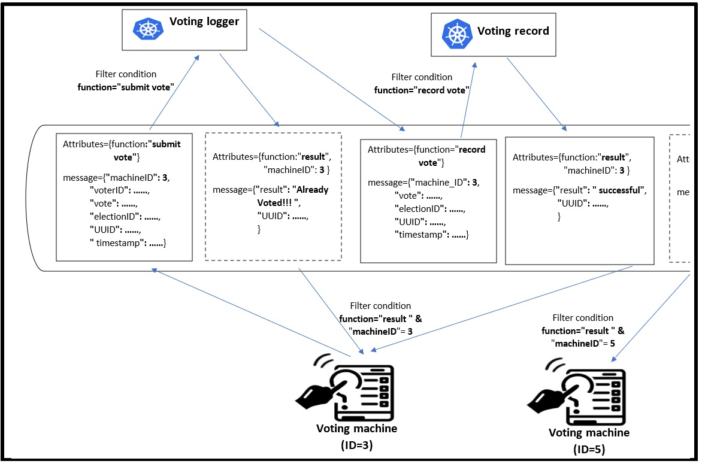
        
## Setting up the GCP Project
1. Create a new topic in Google Pub/Sub with a default subscription. Name the topic, **election**.
2. <div id='serviceAccountKey'> Create a new Service account key, and grant to it the role of Pub/Sub Admin. Download a JSON file for that key (similar to milestone 1).</div>
3. As each service will be containerized, a docker repository is needed to host the docker images of the **logger** and **recorder** services.
   1. Search for Artifact Registry
      
      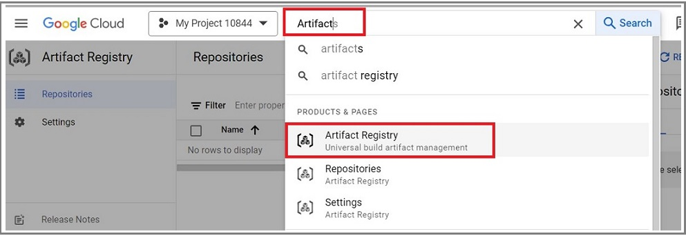
   2. Press the + button to create a new repo within the **repositories** tab.
    
      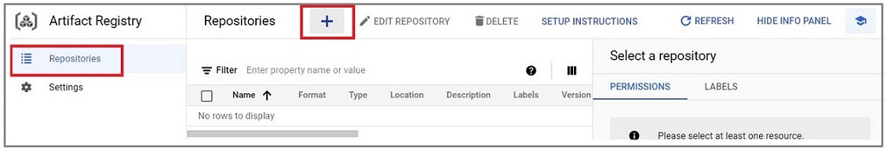
   3. Name it **sofe4630u** and ensure that the type is set to **Docker**. Set the region to **northamerica-northeast2 (Toronto)**. Finally, press **CREATE**.

      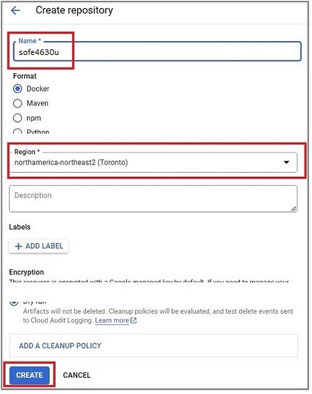
   4. <div id="sofe4630u">open the <b>sofe4630u</b> repository and copy the repo path.</div>

      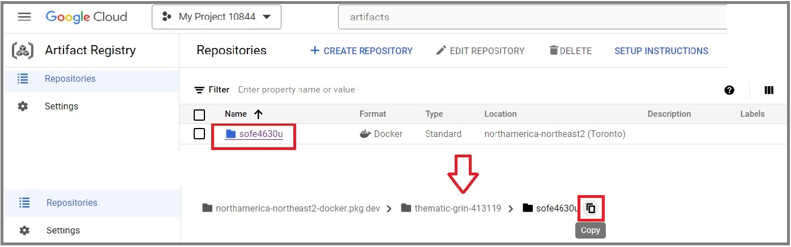

      and save it in an environment variable
      ``` cmd
      REPO=<REPO full path>
      echo $REPO
      ```

## The Logger Service

### The Service Python Script

This subsection will go through the Python script at [voting_logger/main.py](voting_logger/main.py). 
1. **Lines 11-12**: search for a JSON file in the current directory and use it for GCP credentials. It assumes that only a single JSON file exists in the current directory.
2. **Lines 15-18**: To prevent having the values of the configuration variables hardcoded in the code, the values of predefined environment variables will be used to set the values of **redis_host**, **project_id**, **subscription_id**, and **topic_name** variables.
   
   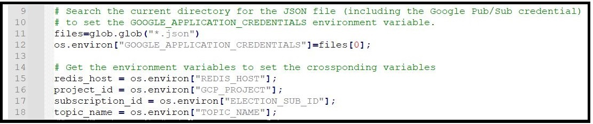

3. **Lines 20-22**: define a **debug** variable and initialize it by **False**. It can be changed to **True** in the code or by setting another environment variable, **DEBUG**. If so, logs and information will be printed for debugging reasons, as in lines 23-28.
   
   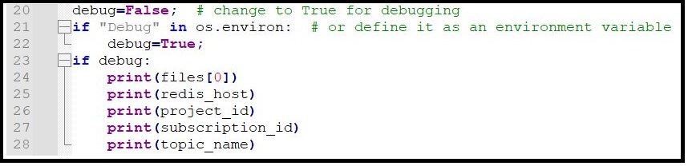

4. **Lines 30-44**: Repeatedly try to connect to the Redis server each second. The service will terminate if the connection isn't established in one minute. 

   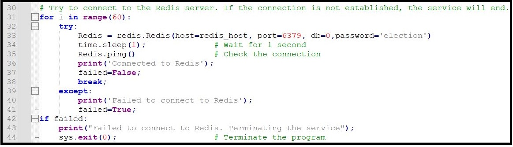
   
5. **Lines 79-101**: create a subscription and use it to subscribe to the topic.
   1. **Line 80**: creates a **subscription path** using the **project ID** and the **subscription ID**.
   2. **Line 81**: creates a filter for the subscription (**function="submit vote"**).
   3. **Lines 89-90**: create a **subscription** for the **subscription path** using the filter.
   4. **Lines 88-93**: create a **subscription** if it does not exist. If it already exists, the creation will fail, and an exception will be thrown to be handled by the except block.
   5. **Lines 97-101**: subscribe to the topic using the **subscription** and set the callback argument to handle the received messages by the **callback** function.

   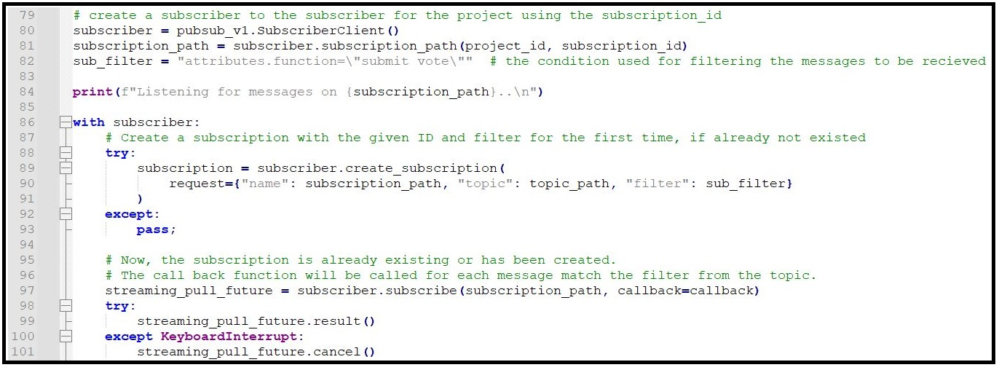

6. **Lines 46-77**: The callback function handles the received message.
   1. **Line 55**: serializes the received message
   2. **Line 61**: generates a key value for the voter by combining the **voter ID** and the **election ID**.
   3. **Line 62**: checks if the key already exists in the Redis server
   4. **Lines 63:65**: if the key exists, an **Already Voted!!!** message will be produced with attributes (**function**="result", **machineID**=...) to be received by the **voting machine**.
   5. **Lines 67:75**: if the key doesn't exist, the voter ID will be excluded, and the updated message will be produced to the topic with attributes (**function**=" record vote") to be processed by the **voting recorder** service. Please note that:
      1. **Line 47**: creates the producer  
      2. **Line 48**: defines the full path to the topic
      3. **line 68**: will store the voting time associated with the key created in line 61 in the Redis server to prevent the voter from voting again.

   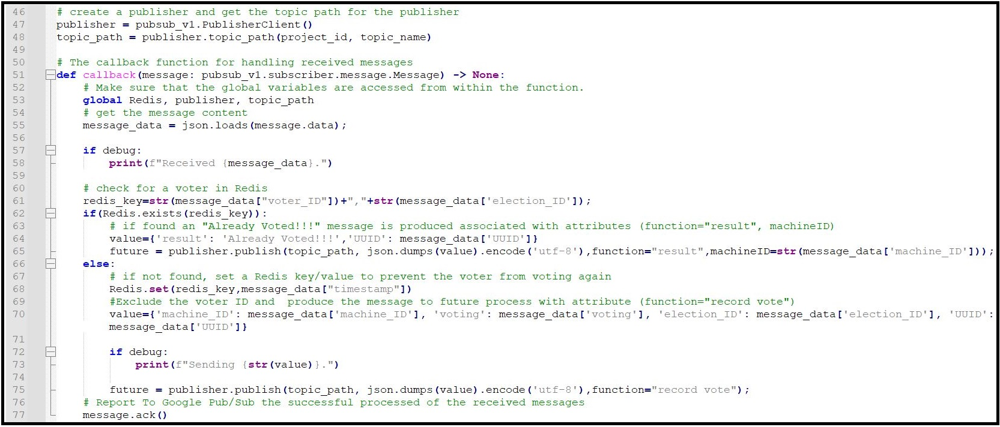
   
### The Deployment of the Service
1. Clone the GitHub repo in the GCP console.
   ``` cmd
   cd ~
   git clone https://github.com/GeorgeDaoud3/SOFE4630U-MS4.git
   ```
2. Copy the JSON file that contains the key of the service account created <a href="#serviceAccountKey">before</a>, to the path **~/SOFE4630U-MS4/voting_logger**.
3. Containerize the service
   1. The Dockerfile at [voting_logger/Dockerfile](voting_logger/Dockerfile) contains instructions on containerizing the service.
      * **Line 1**: uses a Docker image of Linux with a preinstalled Python 3.9 as the basic image.
      * **Line 2**: installs the required Python libraries on the base image.
      * **Line 3**: copies all the JSON files (assumed to be one) from the current directory of the GCP console to the working directory in the base image.
      * **Line 4**: copies the Python file (main.py) from the current directory of the GCP console to the working directory in the base image.
      * **Line 5**: runs the Python script and displays any printed messages in the container logs.

      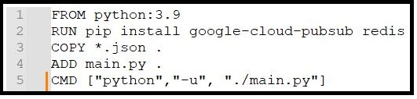
      
   2. The name of the artifact repository will prefix the Docker image name. Run the following commands after replacing **&lt;REPO full path&gt;** with the <a href="#sofe4630u"> repository full path</a>.
      ``` cmd
      REPO=<REPO full path>
      LOGGER_IMAGE=$REPO/logger
      echo $LOGGER_IMAGE
      ```
   3. Make sure that the path **~/SOFE4630U-MS4/voting_logger** contains the JSON file of the service account key, the main.py script, and the Dockerfile.
      ``` cmd
      cd ~/SOFE4630U-MS4/voting_logger
      ls
      ```

      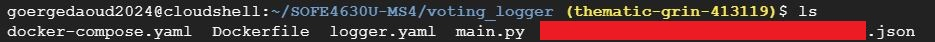
      
   4. Execute the instruction in the Dockerfile and generate the image
      ``` cmd
      cd ~/SOFE4630U-MS4/voting_logger
      docker build . -t $LOGGER_IMAGE
      ```
   5. The docker image is created and stored in the GCP console. This is a temporary and local storage. It should be publicly available by pushing it to the artifact repository for use in a Kubernetes deployment.
      ``` cmd
      docker push $LOGGER_IMAGE
      ```
      **Note**: The prefix of the image name is the path into which the repository is to be pushed.
      
4. Deploy the voting logger service and the Redis server using GKE:
   1. the [voting_logger/logger.yaml](voting_logger/logger.yaml) file contains the deployment instructions. It can be divided into
      * **Lines 29-61**: deploy the Redis server with a single replica for data consistency using **election** as a password. The service name at line 32 (**redis**) is the most important parameter, as other GKE pods will use it as a hostname to access the Redis server.
                          
        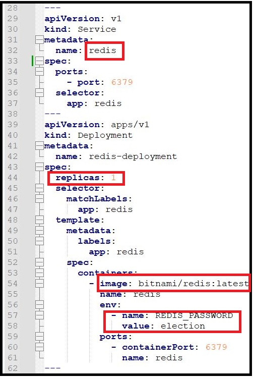
        
      * **Lines 2-27**: The deployment of three replicas of the service. Four environment variables are defined: REDIS_HOST, GCP_PROJECT, ELECTION_SUB_ID, and TOPIC_NAME. Their values will be accessed by the main.py script, as shown in the following figure. Note that the values **$PROJECT** and **$LOGGER_IMAGE** in lines 23 and 17 will be passed to the YAML file before deployment.

        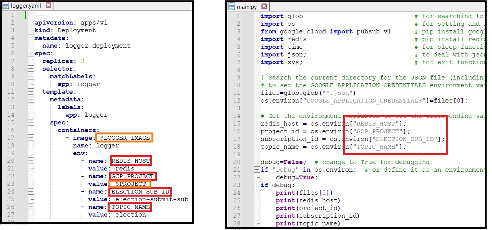

   2. The following command will substitute **$PROJECT** and **$LOGGER_IMAGE** in the YAML file with the corresponding environment variables and and then the service and the Redis server will be deployed.
      ``` cmd
      REPO=<REPO full path>
      LOGGER_IMAGE=$REPO/logger
      PROJECT=$(gcloud config list project --format "value(core.project)")
      
      cd ~/SOFE4630U-MS4/voting_logger
      PROJECT=$PROJECT LOGGER_IMAGE=$LOGGER_IMAGE envsubst < logger.yaml | kubectl apply -f -
      ```
5.	To check the deployment, get the pod list and make sure they are all available. Then, look for a pod for any service replicas. You can print the replica logs for debugging purposes.
      ```cmd
      kubectl get pods
      kubectl logs <pod-name>
      ```
      It should look like
   
      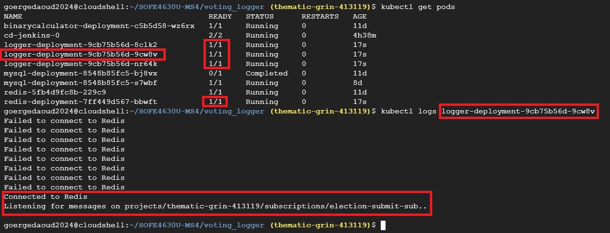
      
6. Finally, if you want to stop the service (**Don't run it now**)
   ```cmd
   cd ~/SOFE4630U-MS4/voting_logger
   kubectl delete -f logger.yaml
   ```

## The Voting Recorder Service

### The Service Python Script

The Python script of the service can be found at [voting_record/main.py](voting_record/main.py). It's similar to that used for the logger service, except

1. **Line 15**: uses the values of predefined environment variables to set the values of the postgres_host for the PostgreSQL server.
   
   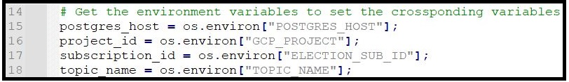

2. **Lines 30-48**: repeatedly try to connect to the PostgreSQL server every ten seconds. The service will terminate if the connection isn't established in ten minutes. 

   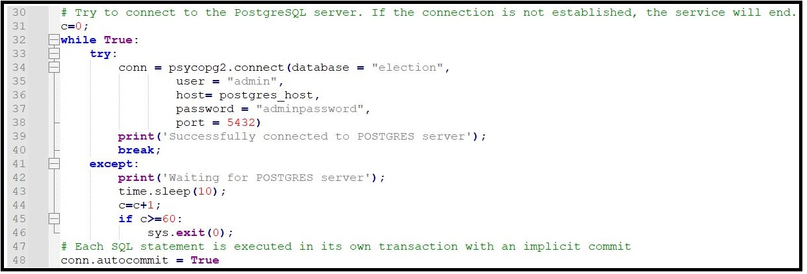
   
5. **Lines 84-106**: create a subscription and use it to subscribe to the topic using the filter for the subscription (**function="record vote"**).
   
   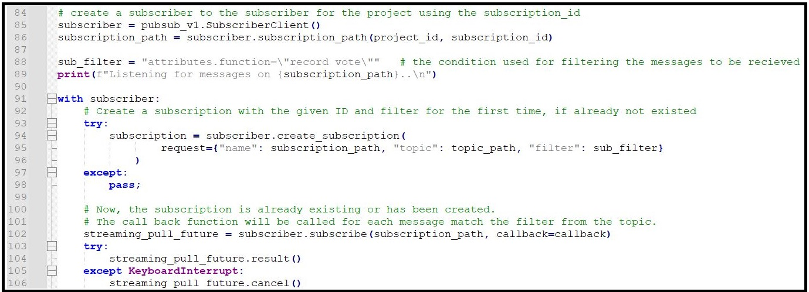

6. **Lines 54-82**: The callback function that handles the received message.
   1. **Lines 65-71**: store the recieved message in the PostgreSQL server.
   2. **Lines 73-79**: a **successful** message will be produced with attributes (**function**="result", **machineID**=...) to be received by the **voting machine**

   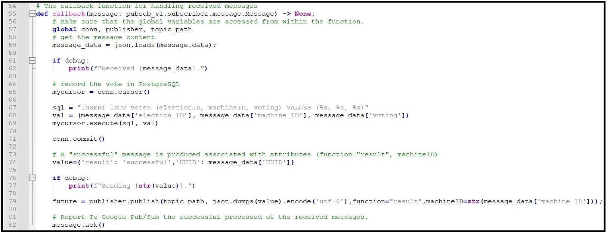
   
### The Deployment of the Service

1. Copy the JSON file that contains the key of the service account created <a href="#serviceAccountKey">before</a>, to the path **~/SOFE4630U-MS4/voting_record**.
2. Containerize the service
   1. The Dockerfile at [voting_record/Dockerfile](voting_record/Dockerfile) looks like the Dockerfile for the logger service except
      **Line 2: ** installs the psycopg2 which is a PostgreSQL client Python Library
      
      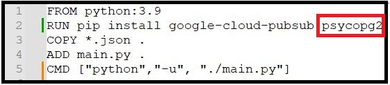
      
   2. Run the following commands after replacing **&lt;REPO full path&gt;** with the <a href="#sofe4630u"> repository full path</a> to generate the full name of the service image.
      ``` cmd
      REPO=<REPO full path>
      RECORDER_IMAGE=$REPO/recorder
      echo $RECORDER_IMAGE
      ```
   3. Make sure that the path **~/SOFE4630U-MS4/voting_record** contains the JSON file of the GCP credential, the main.py script, and the Dockerfile.
      ``` cmd
      cd ~/SOFE4630U-MS4/voting_record
      ls
      ```

      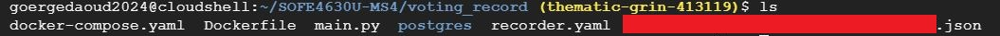
      
   4. Execute the instruction in the Dockerfile to generate the image and push it to the artifact repository. This is an alternative to the **docker build** and **docker push** used in building the logger service.
      ``` cmd
      cd ~/SOFE4630U-MS4/voting_record
      gcloud builds submit -t $RECORDER_IMAGE 
      ```
3. Also, we need to create a Docker image for the PostgreSQL server to create an initial table within the server.
   1. To create an initial table, we must execute an SQL statement found at [voting_record/postgres/CreateTable.sql](voting_record/postgres/CreateTable.sql) in the docker container during initialization. It's much like standard SQL except for the keyword **serial**, which will auto-increment the values in the **id** column.
      
      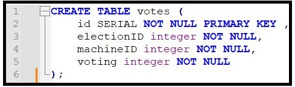
     
   2. The Dockerfile is simple and can be found at [voting_record/postgres/Dockerfile](voting_record/postgres/Dockerfile). It consists of two lines
      * **Line 1**, the base image of PostgreSQL
      * **Line 2** copy the **CreateTable.sql** to the directory **/docker-entrypoint-initdb.d/** in the image. Any SQL script in that directory will be executed during the Docker container initialization.
    
      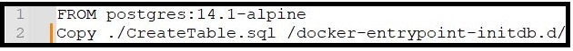

   3. To create and push the Docker image to the repository.
       ``` cmd
      REPO=<REPO full path>
      POSTGRES_IMAGE=$REPO/postgres:election
      echo $POSTGRES_IMAGE
  
      cd ~/SOFE4630U-MS4/voting_record/postgres
      gcloud builds submit -t $POSTGRES_IMAGE
      ```
4. Deploy the voting recorder service and the PostgreSQL server using GKE
   1. the [voting_record/recorder.yaml](voting_record/recorder.yaml) file contains the deployment instructions. It can be divided into
      * **Lines 27-65**: deploy the PostgreSQL server with a single replica for data consistency using **admin** as a user, **adminpassword** as a password, and **election** as an initial database. The service name at line 31 (**postgres**) is the most important parameter, as other GKE pods will use it as a hostname to access the PostgreSQL server. Also, note that an environment variable will replace **$RECORDER_IMAGE** at line 53 before deploying.
        
        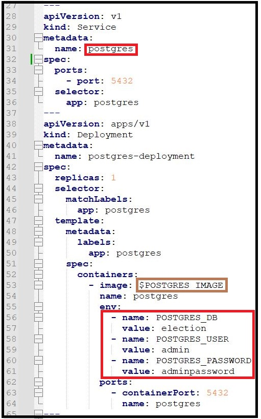
        
      * **Lines 1-26**: The deployment of three replicas of the service. Four environment variables are defined: POSTGRES_HOST, GCP_PROJECT, ELECTION_SUB_ID, and TOPIC_NAME. Their values will be accessed by the main.py script, as shown in the following figure. Note that the values **$PROJECT** and **$RECORDER_IMAGE** in lines 23 and 16 will be passed to the YAML file before deployment.

        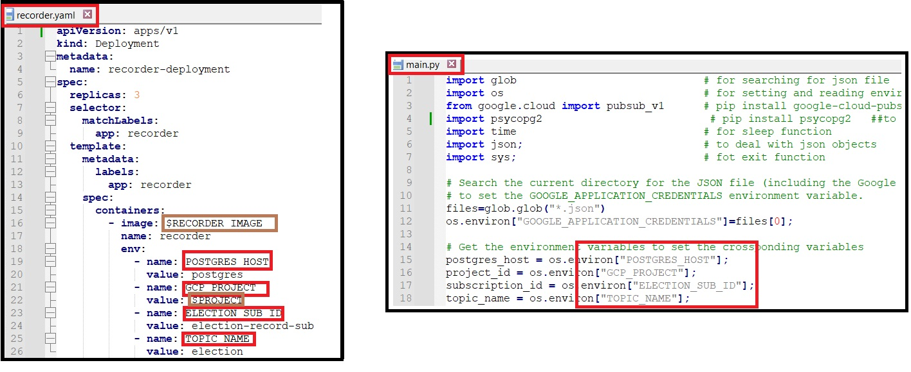

   2. the following command will substitute **$PROJECT**, **$POSTGRES_IMAGE**, and **$RECORDER_IMAGE** in the YAML file with the corresponding environment variables and then deploy the service and the PostgreSQL server.
      ``` cmd
      REPO=<REPO full path>
      RECORDER_IMAGE=$REPO/recorder
      POSTGRES_IMAGE=$REPO/postgres:election
      PROJECT=$(gcloud config list project --format "value(core.project)")
      
      cd ~/SOFE4630U-MS4/voting_record
      POSTGRES_IMAGE=$POSTGRES_IMAGE PROJECT=$PROJECT RECORDER_IMAGE=$RECORDER_IMAGE envsubst < recorder.yaml | kubectl apply -f -
      ```
6. To check the deployment, get the pod list and ensure they are all available. Then, look for any pod of the service replicas and print its logs. 
      ```cmd
      kubectl get pods
      kubectl logs <pod-name>
      ```
      It should look like
   
      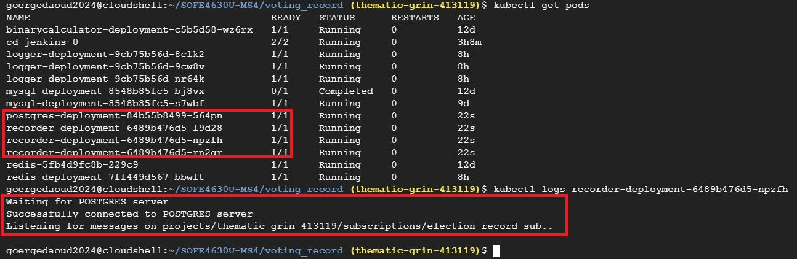
      
7. Finally, if you want to stop the service (**Don't run it now**)
   ```cmd
   cd ~/SOFE4630U-MS4/voting_record
   kubectl delete -f recorder.yaml
   ```
   
## The Voting Machine

### The Service Python Script

This script is assumed to run on your local computer, but you can run it on the GCP console. Thus, there is no need for containerization.
In this section, we will go through its Python code and run it. The main program will generate random votes and send them through Google Pub/Sub topic. A subscriber to the topic will subscribe to messages with the function attribute of the value "result" and a matched machineID attribute. It will wait for a response for the sent vote or signal a time-out. A thread will be created for the subscriber to prevent it from blocking the main program. The script can be broken up into:
* **Lines 10-22**: initial the needed variables. Note that you need to edit line 17 to add your project ID.
  
   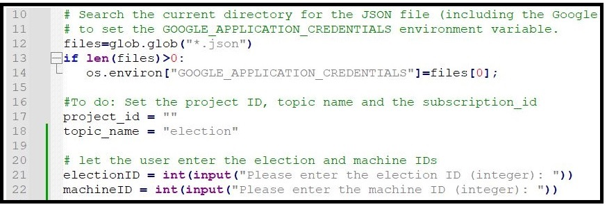
   
*  **Lines 49-62**: define the subscriber and producer and the corresponding variables
  
   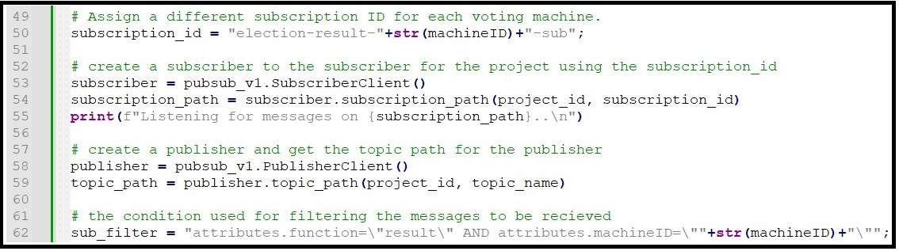
   
*  **Lines 89-113**: the main thread code that iteratively generates a random vote, produces it to the topic, sets the **messageReceived** flag to False, and finally, waits until the subscriber thread changes it to **True**. Otherwise, a time-out message will be printed. Note that the voterId is limited to 100, so repeated voter IDs are more likely to happen. You can increase the limit.
  
   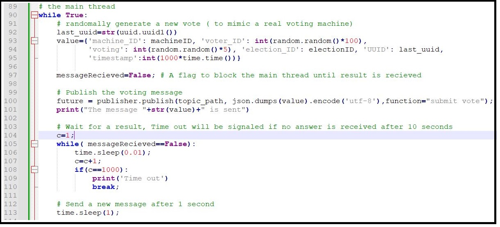
   
*  **Lines 86-87**: create a thread that runs the **thread_function** function.
  
   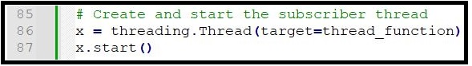
   
*  **Lines 68-83**: define the **thread_function** function that creates a subscription if it doesn't exist. The subscription is configured to filter messages with the attributes of function="result" and a matched **machineID**. It also creates a subscriber with a callback function to handle received messages.
  
   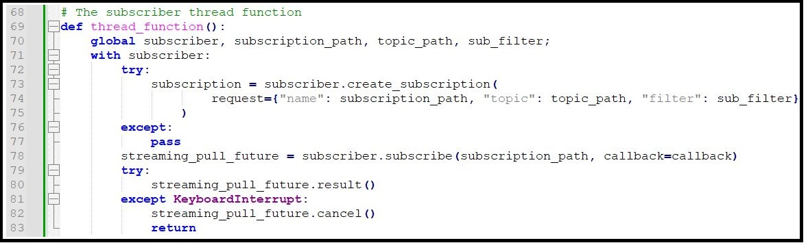
   
*  **Lines 32-47**: define the **callback** function that processes the received messages. If the message UUID matches the last send UUID, **messageRceived** is set to True.
  
   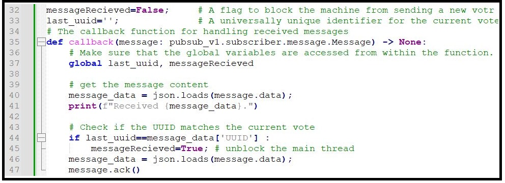
   
*  The interaction between the main thread and the callback function is summarized as
   1. The main thread creates the vote message, saves the UUID of the message as **last_uuid**, and sets the **messageReceived** flag to False.
   2. The callback function checks the UUID of the received messages. If any matches **last_uuid**, the **messageReceived** flag is set to True.
   3. The main thread waits until the **messageReceived** flag is set to True. If no answer is received in 10 seconds, A timeout message is printed
      
   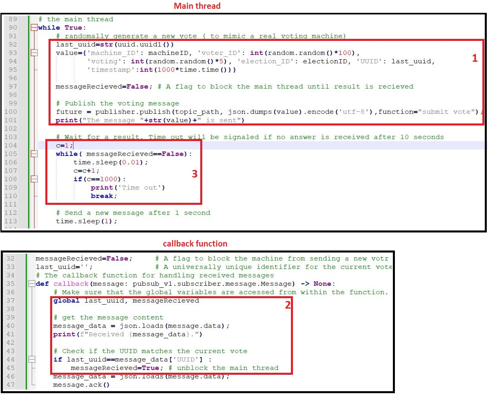

### Run The Python Script

1. Edit the **main.py** within the **voting machine** folder to set the value of the projectID variable in line 17 with your project ID.
2. Copy the JSON file that contains the key of the service account created <a href="#serviceAccountKey">before</a>, to the path as the **main.py** file.
3. Run the Python script
   ```cmd
   python main.py
   ```
4. Enter the machine ID and election ID.
5. You can run other script instances but with different machine IDs.

The output would be similar to 

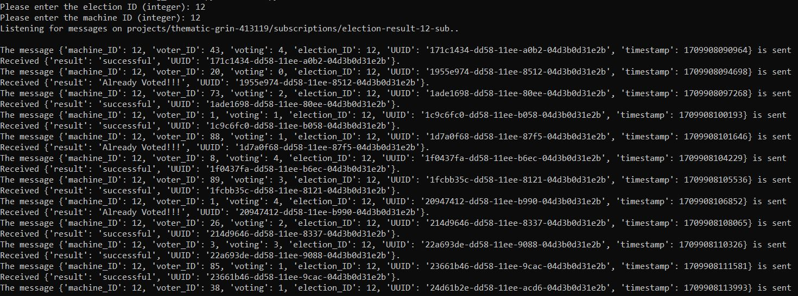

## Design

The [dataset](https://github.com/GeorgeDaoud3/SOFE4630U-Design/blob/main/README.md#the-dataset-description) was updated to include more information for the final step to solve the occluded pedestrian problem. Seven microservices are designed to solve the problem. The description of the microservices is given in [the milestone 4 section](https://github.com/GeorgeDaoud3/SOFE4630U-Design/blob/main/README.md#milestone-4).

Note that the microservices logic has already been implemented. Your task is to update them only to establish the communication between the microservices using a shared bus and to create a producer and consumer.

## Discussion:

Compare the advantages and disadvantages of using Dataflow vs microservices in preprocessing the smart reading.

## Deliverables:

* A report that includes the discussion part. It should also describe the design part and the steps to deploy and execute it.
* An audible video of about 4 minutes showing the deployment and execution of the voting system.
* An audible video of about 5 minutes showing the deployment and execution of the design part showing samples from the results.
* A GitHub link includes the scripts of the design part.
